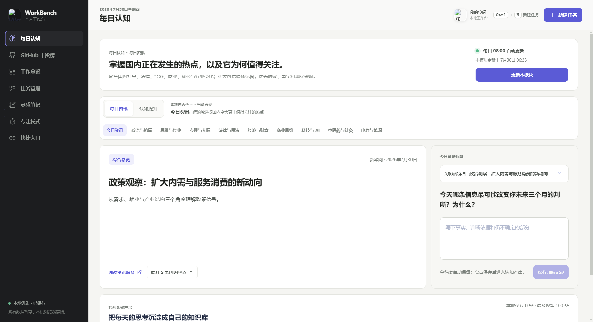
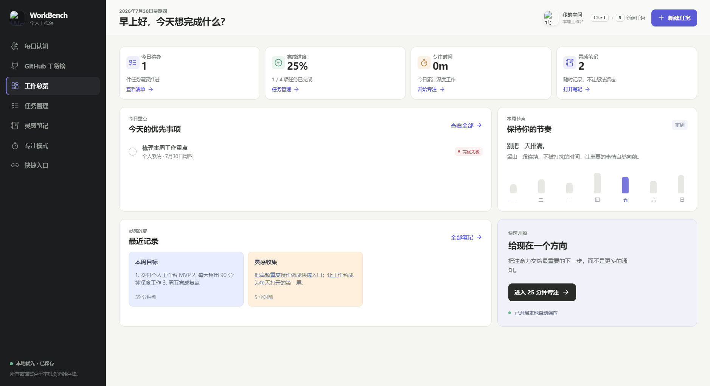

# WorkBench 个人工作台

WorkBench 是一个本地优先、中文交互的 Windows 桌面工作台，将任务、富文本笔记、专注统计、个人题单、每日认知和 GitHub 开源榜单集中在一个应用中。

> 目标：让信息服务于行动，让记录长期留在自己的电脑上。




## 功能

- **工作总览**：今日任务、完成进度、专注时间、最近笔记与一周节奏。
- **任务管理**：三列看板、优先级、截止日期、项目标签和状态流转。
- **灵感笔记**：富文本编辑、标题与引用、代码块、链接、图片粘贴和拖入截图。
- **信息学题单**：题目来源、难度、专题、状态、标签、原题链接和解题记录。
- **专注模式**：25 分钟计时、任务关联、按日归零、累计统计和 26 周热力图。
- **快捷入口**：保存常用网站、文档库和工作工具。
- **每日认知**：
  - 每日资讯：国内公开 RSS 热点；
  - 认知提升：国内可直达的书籍、科普、法律与知识卡；
  - Google 知识：Google 新闻、Wikipedia 和 Wikisource 独立板块，可能需要网络代理。
- **GitHub 干货榜**：开源项目和 Agent Skills 的总榜、周榜，支持拖拽与按钮横向浏览。
- **本地持久化**：任务、笔记、专注和认知产出保存在本机，不需要账号或云数据库。

## 下载与运行

### Windows 安装包

免环境安装程序和便携版通过 [GitHub Releases](https://github.com/NaNaOY/workbench/releases) 发布：

- `WorkBench-Setup-<version>-x64.exe`：标准安装版，可直接覆盖升级；
- `WorkBench-Portable-<version>-x64.exe`：无需安装，下载后直接运行。

安装包已内置 Electron，使用者不需要另外安装 Node.js。当前构建未配置商业代码签名，Windows SmartScreen 可能显示“未知发布者”。

### 从源码运行

开发环境要求 Windows 10/11、Node.js 20 LTS 和 npm：

```powershell
git clone https://github.com/NaNaOY/workbench.git
cd workbench
npm ci
npm run dev
```

也可以在完成 `npm ci` 后双击根目录的 `start-workbench.cmd`。本项目是 Electron 桌面应用，不能通过直接打开 `index.html` 或 GitHub Pages 获得完整功能。

## 常用命令

| 命令 | 作用 |
| --- | --- |
| `npm run dev` | 启动 Vite 与 Electron 开发模式 |
| `npm run typecheck` | 检查渲染层和 Electron 类型 |
| `npm run build` | 生成生产构建 |
| `npm start` | 运行已构建的桌面应用 |
| `npm run package:win` | 生成安装版与便携版 |
| `npm run package:portable` | 只生成便携版 |

构建目录 `dist/`、`dist-electron/` 和 `release/` 均为本地产物，不提交到源码仓库。详细打包流程见 [Windows 桌面版打包](./docs/packaging.md)。

## 数据与网络

- 工作区数据保存在浏览器 `localStorage`，桌面版同时镜像到 Electron `userData/workbench-storage.json`；
- 卸载安装版时默认保留个人数据，便于升级或重新安装后恢复；
- 每日资讯、GitHub 榜单和 Google 知识会请求公开网络数据；
- Google 知识与国内内容源相互隔离，无代理时自动回退到内置 Wiki 卡片；
- 应用不包含遥测，不上传任务、笔记、图片、专注记录或认知产出；
- 医疗、法律和投资内容只用于学习，不构成专业意见。

更多说明：

- [隐私与数据边界](./docs/privacy.md)
- [每日认知内容源](./docs/content-sources.md)
- [Windows 桌面版打包](./docs/packaging.md)

## 项目结构

```text
workbench/
├─ docs/                         # 公开文档与界面预览
├─ electron/
│  ├─ main.ts                    # Electron 应用入口
│  ├─ preload.ts                 # 最小权限 IPC 桥接
│  ├─ storage.ts                 # 本机数据镜像
│  ├─ content.ts                 # 更新调度、GitHub 与外链 IPC
│  ├─ cognition.ts               # 国内资讯抓取和筛选
│  ├─ learning.ts                # 认知提升内容库
│  ├─ overseas.ts                # Google 新闻与 Wiki 海外内容
│  ├─ knowledge-sources.ts       # 国内知识来源路由
│  ├─ article-url.ts             # 外链校验和旧地址迁移
│  └─ feed.ts                    # RSS / XML 解析工具
├─ public/assets/                # 图标、Logo 和公开界面素材
├─ src/
│  ├─ components/                # 编辑器、题单、专注统计等组件
│  ├─ App.tsx                    # 应用壳、路由和全局状态
│  ├─ AppViews.tsx               # 工作总览、任务、笔记等视图
│  ├─ DailyCognitionView.tsx     # 每日认知三个模块
│  ├─ KnowledgeViews.tsx         # GitHub 干货榜
│  ├─ data.ts                    # 默认数据与本地日期工具
│  ├─ storage.ts                 # 统一缓存读写
│  ├─ types.ts                   # 共享类型
│  └─ *.css                      # 页面与主题样式
├─ electron-builder.portable.json
├─ package.json
└─ vite.config.ts
```

## 公开仓库边界

仓库只包含可复现应用所需的源码、公开素材、构建配置和文档。以下内容被忽略：

- `node_modules/`、`dist/`、`dist-electron/`、`release/`；
- `.env`、本地配置、日志、编辑器缓存和临时设计目录；
- `workbench-storage.json` 及任何任务、笔记、图片和阅读记录；
- 访问令牌、账号信息、个人电脑绝对路径和私有接口。

提交前建议运行：

```powershell
npm run typecheck
npm run build
```

## 贡献与许可

欢迎提交 Issue 和 Pull Request。请勿在公开内容中粘贴任务、笔记、访问令牌、本机路径或其他个人数据。

项目使用 [MIT License](./LICENSE)。第三方网站内容、外部 RSS、图标和用户自有素材仍受各自许可约束。

当前源码版本：`0.2.0`。
